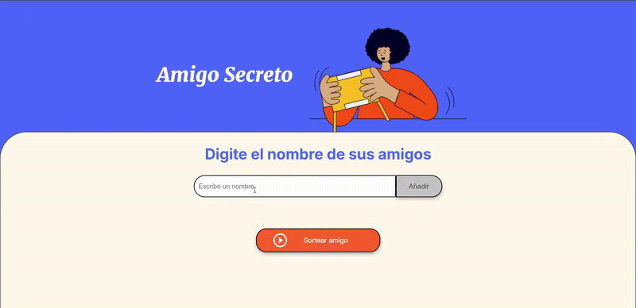

<!-- # challenge-amigo-secreto -->

  <h1 align="center">
    Challenge Amigo Secreto
     
     
    
    </a>
  </h1>

## Introduction

Esta aplicación permite a los usuarios ingresar nombres de amigos en una lista para luego realizar un sorteo aleatorio y determinar quién es el "amigo secreto".

## Funcionalidades

- **Agregar nombres**: Los usuarios escribirán el nombre de un amigo en un campo de texto y lo podrán agregar a una lista visible en la página al hacer clic en "Añadir".
- **Validar entrada**: Si el campo de texto está vacío, el programa mostrará una alerta solicitando que se ingrese un nombre.
- **Visualización de la lista**: Los nombres que el usario agregó, aparecerán en una lista debajo del campo de entrada.
- **Sorteo Aleatorio**: Al hacer clic en el botón "Sortear Amigo", se seleccionará aleatoriamente un nombre de la lista y lo mostrará como el "Amigo Secreto".

## Requisitos

Para ejecutar esta aplicación necesitarás tener instalado un navegador web moderno.

## Uso

1. Escribir el nombre de un amigo en el campo de texto.
2. Hacer click en el botón "Añadir" para agregar el nombre a la lista.
3. Los nombres ingresados se podrán ver en una lista visible en la página.
4. Una vez que se hayan ingresado todos los nombres, se debe hacer click en "Sortear Amigo" para seleccionar aleatoriamente un nombre de la lista.
5. El nombre seleccionado se mostrará en la página!!.

## Tecnologías

- `index.html`: Contiene la estructura básica HTML de la aplicación.
- `style.css`: Contiene los estilos CSS para la aplicación.
- `app.js`: Contiene la lógica de JavaScript para agregar nombres, validar la entrada, mostrar la lista y realizar el sorteo aleatorio.

### Créditos

Desarrollado como parte del Challenge Amigo Secreto basado en el concepto Challenge Based Learning.
